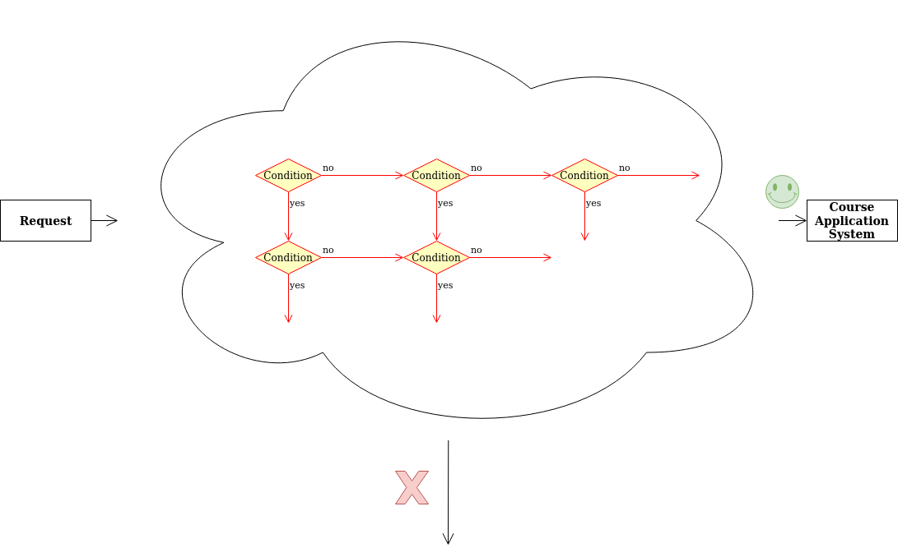
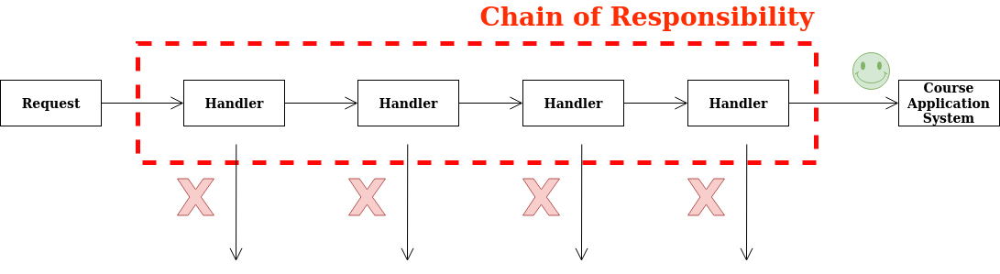
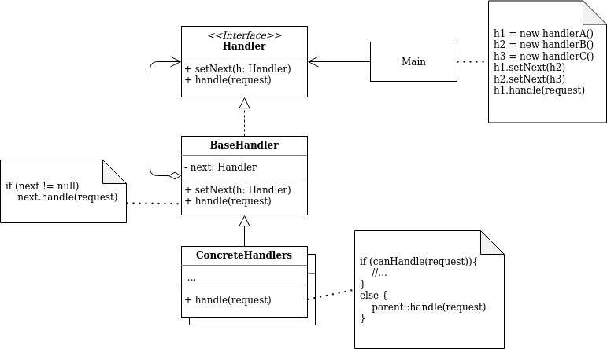

# Chain of Responsibility

## What is Chain of Responsibility?

- behavioral design pattern that lets you pass requests along a chain of handlers
- Upon receiving a request, each handler decides either to process the request or to pass it to the next handler in the chain.

## Problem

Imagine that you're working on an online Course Application System. Here are a list of checks before a course can be applied.

- One of your colleagues suggested that it’s unsafe to pass raw data straight to the course application system. So you added an extra validation step to sanitize the data in a request.
- One of your colleagues noticed that the system is vulnerable to brute force password cracking. To negate this, you promptly added a check that filters repeated failed requests coming from the same IP address.
- One of your colleagues suggested that you could speed up the system by returning cached results on repeated requests containing the same data. Hence, you added another check which lets the request pass through to the system only if there’s no suitable cached response.

### TLDR

- The code of the checks, which had already looked like a mess, became more and more bloated as you added each new feature
- Changing one check sometimes affected the others
- Worst of all, when you tried to reuse the checks to protect other components of the system, you had to duplicate some of the code since those components required some of the checks, but not all of them.

## Solution

- CoR relies on transforming particular behaviors into stand-alone objects called `handlers`
- The pattern suggests that you link these handlers into a chain
- Each linked handler has a field for storing a reference to the next handler in the chain. In addition to processing a request, handlers pass the request further along the chain
- The request travels along the chain until all handlers have had a chance to process it.

## Class Diagram

### Handler

- declares the interface common to all concrete handlers.
- usually contains just 1 method for handling requests and another method to set the next handler in the chain

### Base handler

- optional class to put the boilerplate code that's common to all handler class
- this class defines a field for storing a reference to the next handler
- the main class build a chain by passing a handler to the constructor or setter of the previous handler

### Main

- compose chains just once or compose them dynamically depending on the app logic

### Concrete Handlers

- contain actual logic for processing requests
- upon receiving a request, each handler decide whether to process it and whether to pass it along the chain
- usually self contained and immutable, accepting all necessary data just one via the constructor

## How to Apply?

- use the pattern when the system is expected to process different kind of requests in many ways but the exact types of request and sequences are unknown beforehand
- use the pattern when it's important to execute many handlers in a certain order
- use the pattern when the set of handlers and their order are supposed to change at runtime

## Pros and Cons

### Pros

- control the order of request handling
- Fulfills *Single Responsibility Princple*
- Fulfills *Open/Closed Principle*

### Cons

- some request may end up unhandled