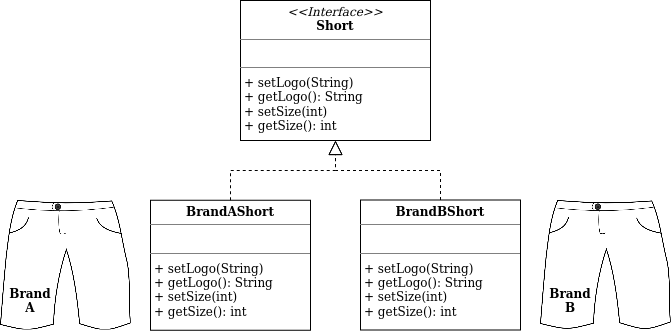
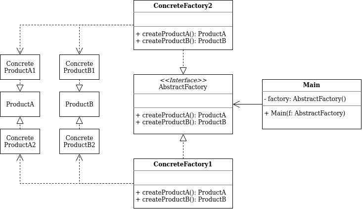

# Abstract Factory

## What is Abstract Factory?

- creational design pattern
- solves the problem of creating entire product families without specifying their concrete classes

## Problem

Imagine that you are creating a Sports Attire shop. Your code could consist of classes that represent:
1. A group of related products: `Shirt` + `Short`
2. Variants of this group. For example, products `Shirt` + `Short` are available in these variants: `Brand A`, `Brand B`

Customers are unhappy when they receive non-matching sports attire. There needs to be a way to create individual sport attire objects so that they match other objects of the same group.

Then there is another problem where sport attire vendors update their catalog often and you wouldn't want to change the code source code each time it happends.

## Solution

- explicitly declare interfaces for each distinct product of the product group
- then make all variants of products follow those interfaces
- for example, all shorts variants can implement the `Short` interface and etc

- declare the Abstract Factory - an interface with a list of creation methods for all products that are part of the product group (for example, `makeShirt`, `makeShort` and etc)
- these methods must return abstract product types represented by the interfaces extracted previously: `Shirt`, `Short` and etc

- For each variant of a product group, create a separate factory class based on the AbstractFactory interface
- The client code has to work with both factories and products via their respective abstract interfaces
- This allows changes to the type of a factory that pass to the client code, as well as the product variant that the client code receives, without breaking the actual client code

## Class Diagram

## How to Apply?

- When your code needs to work with various families of related products and do not want to depend on concrete classes of those products
- When you do not want to worry about creating wrong variant of a product that does not match the products already created by your application

## Pros and Cons

### Pros

- The products that you are getting from a factory are compatible with each other
- Avoid tight coupling between concrete products and client code
- Fulfills *Single Responsibility Princple*
- Fulfills *Open/Closed Principle*

### Cons

- Code may become complicated than it should be